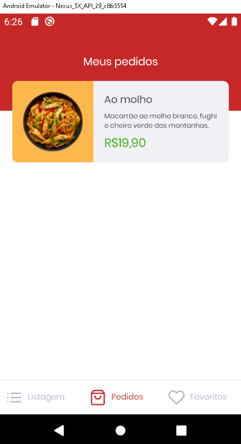
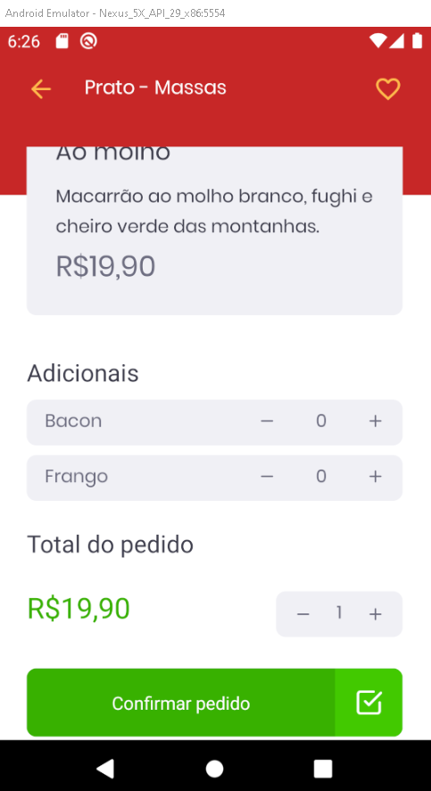
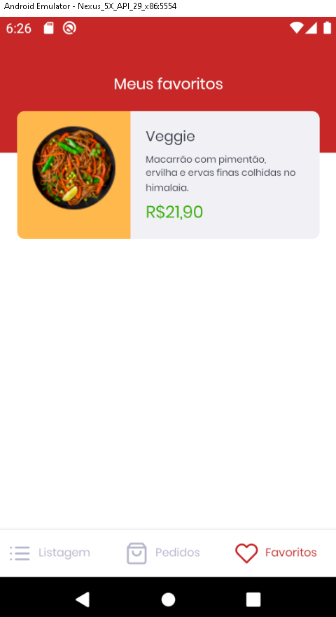

  

# Desafio 11: GoRestaurant web
> Desafio do bootcamp Rocketseat

Nesse desafio, desenvolvemos mais uma aplicação, a GoRestaurant, só que dessa vez a versão mobile para o cliente. Praticamos o que aprendemos até agora no React Native junto com TypeScript, para criar um pequeno app para pedidos de comida.

Essa será uma aplicação que irá se conectar a uma Fake API, e exibir e filtrar os pratos de comida da API e permitir a criação de novos pedidos.

Tabela de conteúdos

=================

<!--ts-->
  * [Principais tecnologias](#Principais-tecnologias)
  * [Template da aplicação](#Template-da-aplicação)
  * [Layout da aplicação](#Layout-da-aplicação)
  * [Funções](#Funções)
  * [Rotas](#Rotas)
  * [Testes](#Testes)
  * [Como rodar na sua máquina](#Como-rodar-na-sua-máquina)

<!--te-->

## Principais tecnologias
- React Native
- Typescript
- Styled components

## Template da aplicação
Para nos ajudar nesse desafio, a rocketseat criou para nós um modelo que nós devemos utilizar como um template do Github.

Link: https://github.com/rocketseat-education/gostack-template-react-native-delivery

## Layout da aplicação
Essa aplicação possuía um layout que nós pudéssemos seguir para conseguir visualizar o seu funcionamento.

O layout pode ser acessado através da página do Figma: https://www.figma.com/file/cHzfYrUBgdzp1XrRuUpggk/GoRestaurant-Mobile?node-id=1603%3A448

  
  
  
  
  

  

#### OBS.: O layout da aplicação já estava feito, nós precisávamos executar as funções da aplicação e não desenvolver o layout.

## Funções
- [x] Listar os pratos de comida da sua API
- [x] Listar as categorias da sua API
- [x] Filtrar pratos de comida por busca ou por categorias
- [x] Listar os pedidos da sua API
- [x] Listar os pratos favoritos da sua API
- [x] Realizar um pedido

## Rotas

> /foods: Retorna todas as comidas cadastradas na API

> /foods/:id: Retorna um prato de comida cadastradas na API baseado no id

> /categories: Retorna todas as categorias cadastradas na API

> /orders: Retorna todas os pedidos que foram cadastrados na API

> /favorites: Retorna todas as comidas favoritas que foram cadastrados na API

## Testes
#### Obs.: Todos os testes foram desenvolvidos pelo pessoal da rocketseat, ou seja, quando nós baixamos o template os testes já vieram prontos.

 - should be able to list the food plates: Para que esse teste passe, sua aplicação deve permitir que sejam listados na sua Dashboard, todos os pratos de comidas que são retornados da sua fake API.

 - should be able to list the food plates filtered by category: Para que esse teste passe, sua aplicação deve permitir que sejam listados na sua Dashboard, os pratos de comidas filtrados por categoria da sua fake API.

 - should be able to list the food plates filtered by name search: Para que esse teste passe, sua aplicação deve permitir que sejam listados na sua Dashboard, os pratos de comidas filtrados por nome da sua fake API.

 - should be able to navigate to the food details page: Para que esse teste passe, em sua Dashboard, você deve permitir que ao clicar em um item, seja navegado para a página FoodDetails passando por parâmetro da navegação o id do item clicado.

 - should be able to list the favorite food plates: Para que esse teste passe, sua aplicação deve permitir que sejam listados na sua página Favorites, todos os pratos de comidas que estão salvos na rota favorites.

 - should be able to list the orders: Para que esse teste passe, sua aplicação deve permitir que sejam listados na sua página Orders, todos os pratos de comidas que estão salvos na rota orders.

 - should be able to list the food: Para que esse teste passe, sua aplicação deve permitir que seja listado todos os dados de uma comída específica na página FoodDetails, baseado no id recuperado pelos parametros da rota.

 - should be able to increment food quantity: Para que esse teste passe, você deve permitir que seja incrementada em 1 a quantidade do item na página FoodDetails.

 - should be able to decrement food quantity: Para que esse teste passe, você deve permitir que seja decrementada em 1 a quantidade do item na página FoodDetails.

 - should not be able to decrement food quantity below than 1: Para que esse teste passe, você deve impedir que seja decrementado a quantidade de itens até um número menor que 1, assim o número mínimo de itens no pedido é 1.

- should be able to increment an extra item quantity: Para que esse teste passe, você deve permitir que seja incrementada em 1 a quantidade de um ingrediente extra na página FoodDetails baseado no seu id.

- should be able to decrement an extra item quantity: Para que esse teste passe, você deve permitir que seja decrementado em 1 a quantidade de um ingrediente extra na página FoodDetails baseado no seu id.

## Como rodar na sua máquina

Clone o repositório com:
> git clone https://github.com/Matheus-SS/GoRestaurantMobile.git

Abra o arquivo e instale todas as suas dependências,se você estiver utilizando o `Yarn` assim como eu, como seu gerenciador de pacote, apenas digite:
> yarn

E irá instalar todas as dependencias necessárias.

No terminal digite o código abaixo para executar o server local.
> yarn json-server server.json -p 3333

Digite `yarn android` para executar a aplicação, a seguir irá abrir a aplicação no emulador.

