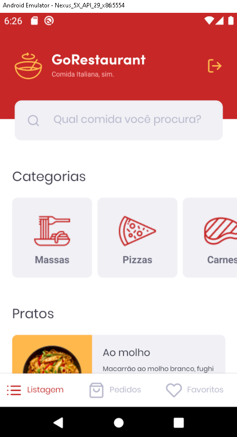

  

# Desafio 10: GoRestaurant web
> Desafio do bootcamp Rocketseat

Nesse desafio, o objetivo era desenvolver mais uma aplicação, a GoRestaurant. E praticar o que nós aprendemos até agora no React.js junto com TypeScript, praticando o conceito de CRUD (Create, Read, Update, Delete).

Essa será uma aplicação que irá se conectar a uma fake API, e exibir os pratos de comida criados e permitir a criação, remoção e atualização desses pratos.

## Principais tecnologias 
- React.js
- Typescript

## Template da aplicação
Para nos ajudar nesse desafio, a rocketseat criou para nós um modelo que nós devemos utilizar como um template do Github.

Link: https://github.com/rocketseat-education/gostack-template-reactjs-crud

## Layout da aplicação
Essa aplicação possuía um layout que nós pudéssemos seguir para conseguir visualizar o seu funcionamento.

O layout pode ser acessado através da página do Figma: https://www.figma.com/file/1lK6AVCPybtWeBLCH8B08N/GoRestaurant?node-id=0%3A1

  

#### OBS.: O layout da aplicação já estava feito, nós precisávamos executar a lógica da aplicação e não desenvolver o layout.

## Funções
- [x] Listar os pratos de comida da sua API
- [x] Adicionar novos pratos de comida a sua API
- [x] Editar pratos de comida da sua API
- [x] Remover pratos de comida da sua API
- [x] Alterar disponibilidade dos pratos de comida da sua API

## Como rodar na sua máquina

Clone o repositório com:
> git clone https://github.com/Matheus-SS/GoRestaurant-Web.git

Abra o arquivo e instale todas as suas dependências,se você estiver utilizando o `Yarn` assim como eu, como seu gerenciador de pacote, apenas digite:
> yarn

E irá instalar todas as dependencias necessárias.

Digite `yarn start` para executar a aplicação, a seguir irá abrir a aplicação no seu navegador.

> Esse projeto está sob a licença MIT. Veja o arquivo [LICENSE](https://github.com/Matheus-SS/GoRestaurant-Web/blob/master/LICENSE) para mais detalhes.
